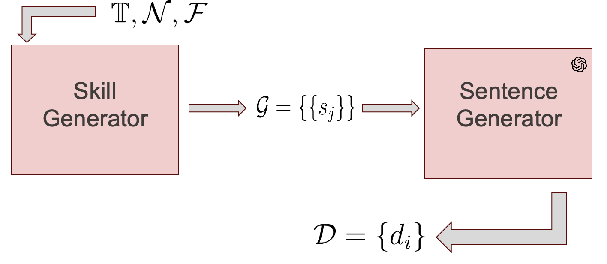
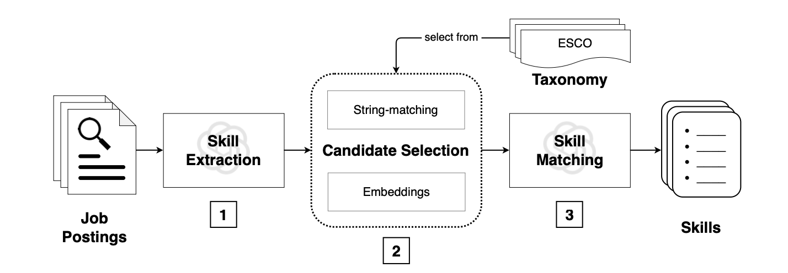

# SkillSkape

This is the source code for paper [JOBSKAPE: A Framework for Generating Synthetic Job Postings to
Enhance Skill Matching]().


## Getting Started
Start with creating a **python 3.7** venv and installing **requirements.txt**.


## JobSkape Framework



We present a dataset generation framework to produce datasets for entity matching tasks. The mechanism is displayed in [this notebook](./data_generation.ipynb).

It works with two components. First we generate <ins>**faithful combinations of entities**</ins> :

```python
from generator import SkillsGenerator

gen = SkillsGenerator(taxonomy=emb_tax, ## input taxonomy embedded with a precise model 
            taxonomy_is_embedded=True, ## if the taxonomy is not yet embedded, provide a model
            combination_dist=combination_dist, ## combination size distribution
            emb_model=None, ## if not yet embedded, an encoder Mask Language Model
            emb_tokenizer=None, ## related tokenizer
            popularity=F ## popularity distribution
    )

gen_args = {
    "nb_generation" : split_size, # number of samples
    "threshold" : 0.83, # not considering skills that are less than .8 similar
    "beam_size" : 20, # considering 20 skills
    "temperature_pairing": 1, # popularity to be skewed toward popular skills
    "temperature_sample_size": 1,
    "frequency_select": True, # wether we select within the NN acording to frequency
}


generator = gen.balanced_nbred_iter(**gen_args) ## a generator
```


Then we generate <ins>**faithful sentence for each entity combination**</ins>:

```python

datagen = DatasetGenerator(emb_tax=emb_tax,
                           reference_df=None, ## no references, we work in Zero-Shot, you can input demponstration for kNN demonstration retrieval
                           emb_model=word_emb_model ## encoder Mask Language model to get embeddings,
                           emb_tokenizer=word_emb_tokenizer ## associated tokenizer,
                           additional_info=None ## potential additional information that can be added in custom promopt
            )

    generation_args = {
        "skill_generator": combs[:n_samples], 
        "specific_few_shots": False,
        "model": "gpt-3.5",
        "gen_mode": ["PROTO-GEN-A0" for Dense or "PROTO-GEN-A1" for Sparse],
        "autosave": True,
        "autosave_file": f"generated/SKILLSPAN/{split}.json",
        "checkpoints_freq":10
    }
    res = datagen.generate_ds(**generation_args)
```


Then you generate negative samples:


#### With excluded taxonomy:

```python
gen = SkillsGenerator(taxonomy=excluded_tax_sp, 
                taxonomy_is_embedded=True,
                combination_dist=combination_dist,
                popularity=F)
    
gen_args = {
        "nb_generation" : 500, # number of samples
        "threshold" : 0.83, # not considering skills that are less than .8 similar
        "beam_size" : 20, # considering 20 skills
        "temperature_pairing": 1, # popularity to be skewed toward popular skills
        "temperature_sample_size": 1,
        "frequency_select": True, # wether we select within the NN acording to frequency
    }


combinations = list(gen.balanced_nbred_iter(**gen_args))


datagen = DatasetGenerator(excluded_tax_sp,
                           None, ## no references, we work in Zero-Shot
                           word_emb_model,
                           word_emb_tokenizer,
                           additional_info)

generation_args = {
        "skill_generator": combinations, 
        "specific_few_shots": False,
        "model": "gpt-3.5",
        "gen_mode": "PROTOTYPE",
        "autosave": True,
        "autosave_file": f"generated/SKILLSPAN/excluded_tax_samples.json",
        "checkpoints_freq":10
    }
res = datagen.generate_ds(**generation_args)

```

#### With no labels :

```python


## put code


```


## SkillSkape Dataset

```
supervised
├── multilabel_classifier.py
├── run_classifier.sh
└── run_inference.sh
```

- `multilabel_classifier.py` : implementation of supervised model based on BERT for multiclass classification
- `run_classifier.sh` : training script
- `run_inference.sh` : inference script


## Models 

### Supervised :

how to train it ? bash 


### Unspervised - In Context Learning

how to train it ?



